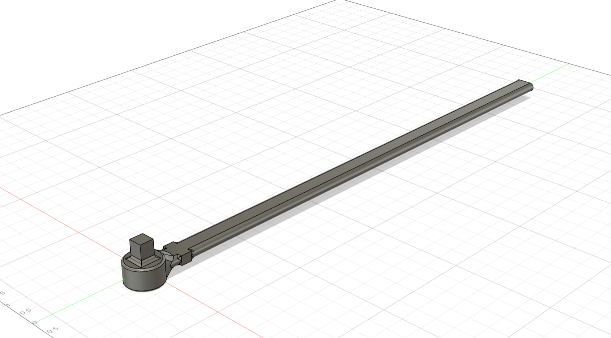
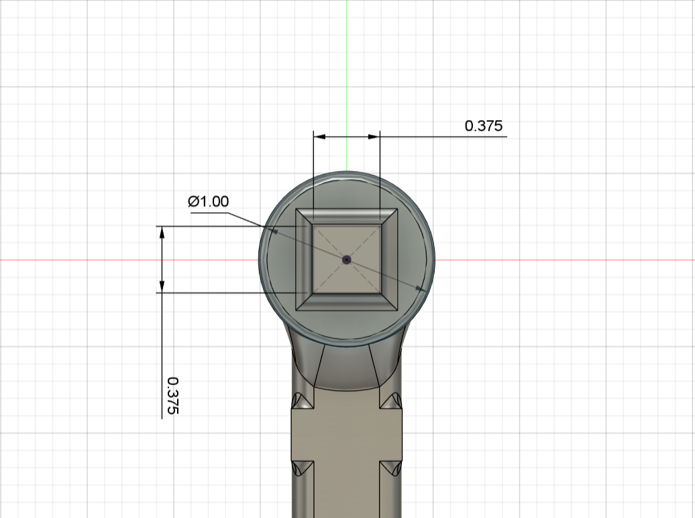
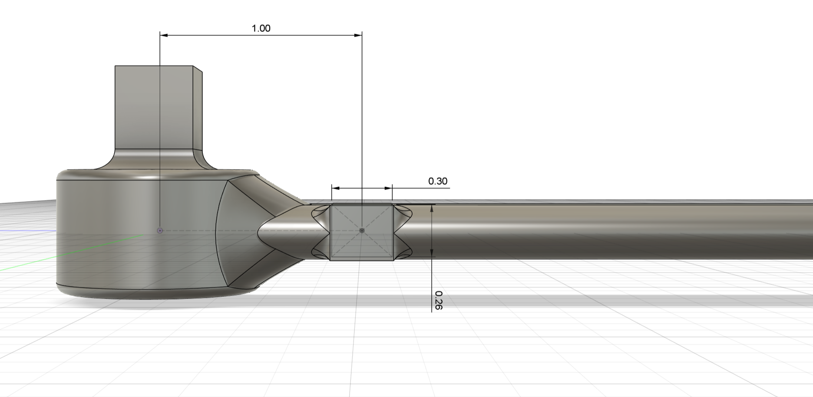
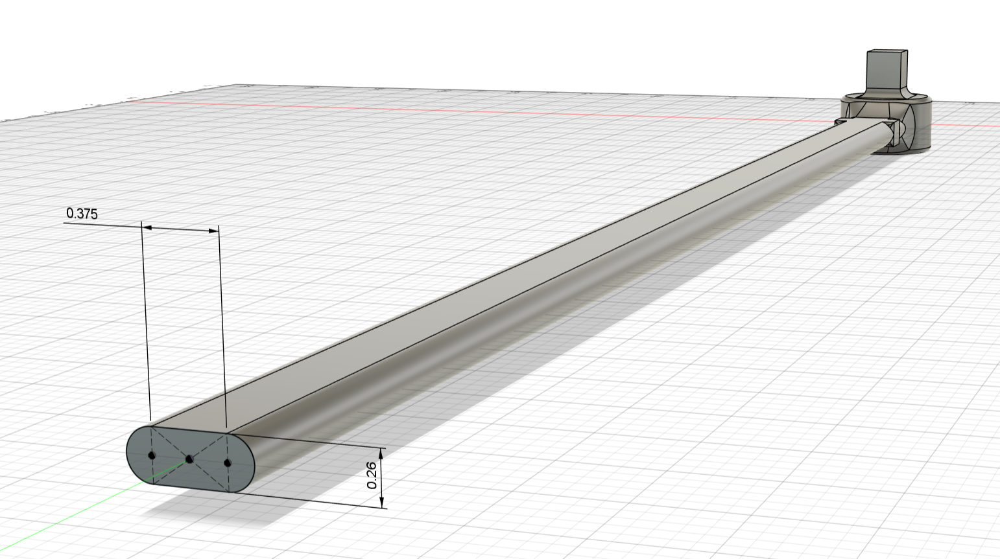
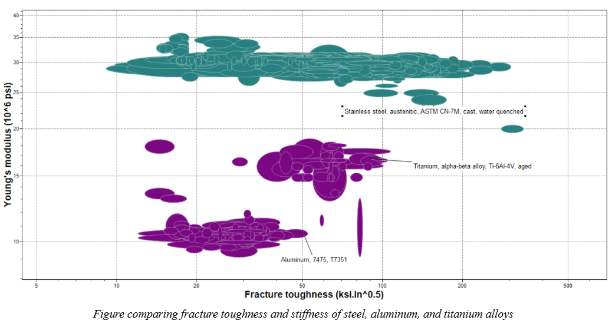
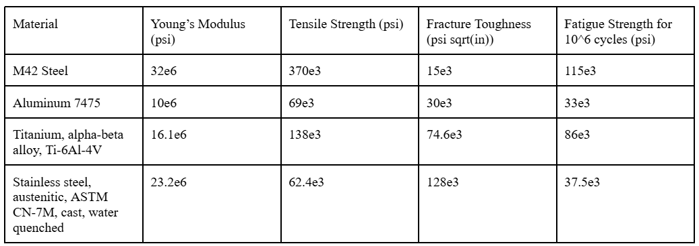

5.2.1.1
The torque wrench design includes a slotted cross section which increases the moment of inertia in the bending direction. Flats are incorporated on the handle near the drive to integrate the strain gauge. Fillets from the handle to the strain gauge flats help mitigate possible stress concentration at this corner. A circular head with a greater area moment of inertia was included to minimize stress on the fixed end due to the larger bending moment. The design includes a large fillet from the circular head to the wrench handle to prevent stress concentrations. The length from the free end to the drive is 16 inches. 

    

    

    

    

5.2.1.2

    

    

Found several samples with different material compositions to optimize for compliance while maintaining a good fracture toughness, as that was a parameter that was the closest to the safety factor limit in the base case. 
After much analysis and iteration, our final design utilizes Titanium alpha-beta alloy (Ti-6Al-4V). This alloy’s relatively low Young’s Modulus allows for the required strain at the strain gauge, while at the same time possessing a great enough tensile strength, fracture toughness, and fatigue strength to satisfy our factors of safety (see above chart for values). 

5.2.1.3

